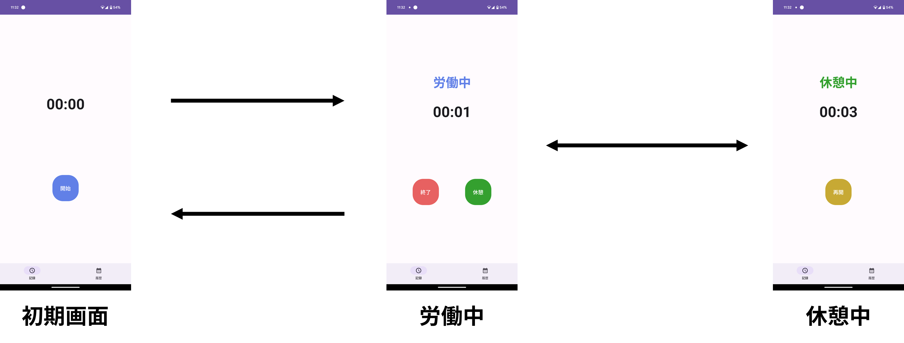
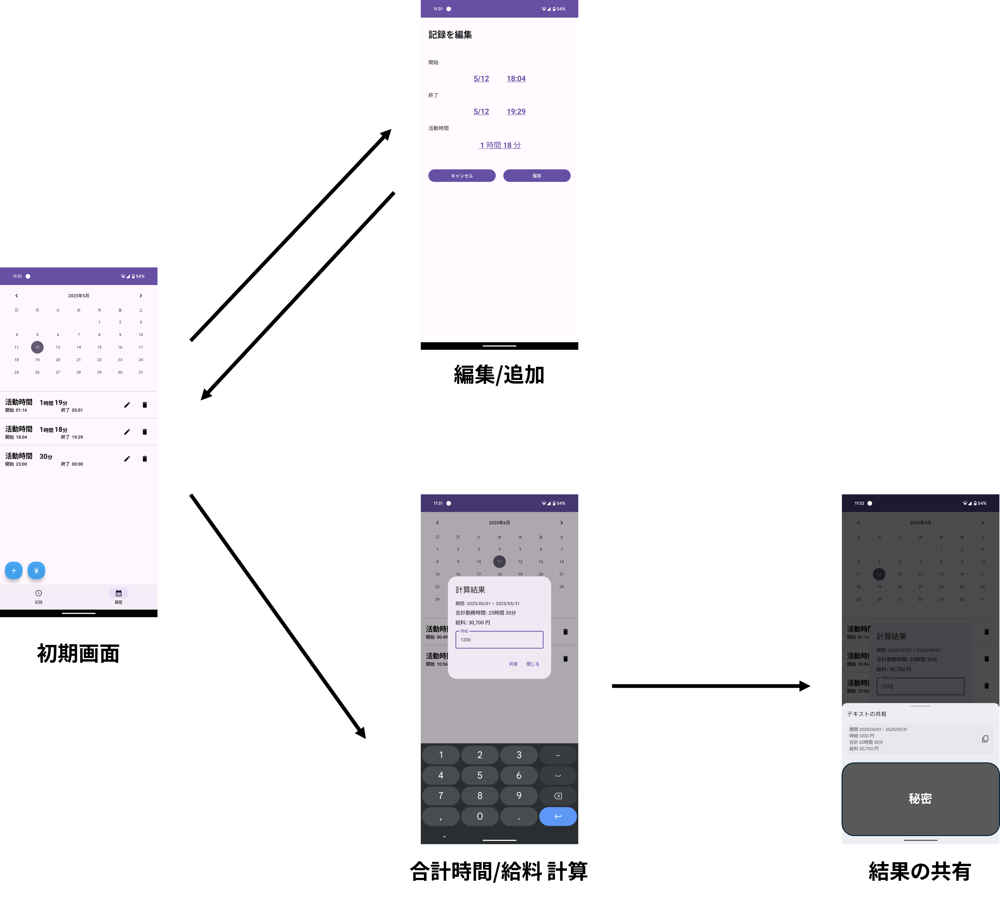

# Working Timer
## 概要
### モチベーション
- 所属する研究室で行われる共同研究アルバイトの労働時間の計測と，指定期間の勤務時間や給料の計算の面倒さを解消したい

### 特徴
- タイマーで計測した記録を同アプリ内でカレンダーで保持しておいて，後から自由に期間内の勤務時間を計測が可能
- 計算結果を共有できて，担当教員への連絡も簡単

### 使用技術
Kotlin，Jetpack Compose，Room，Kotlin coroutines

## 構成
```
├── data                                // データベース関連のファイルを格納します．
|   ├── AppDatabase.kt                  // Roomデータベースのインスタンスを提供します．
|   ├── Work.kt                         // 勤務記録のエンティティを定義します．
|   └── WorkDao.kt                      // データベース操作（CRUD）のDAOインターフェースを定義します．
├── service                             // バックグラウンドサービス関連のファイルを格納します．
|   ├── TimerActionReceiver.kt          // 通知からのタイマー操作を受け取るBroadcastReceiverです．
|   └── TimerService.kt                 // タイマーのロジックとフォアグラウンド通知を管理するサービスです．
├── ui                                  // UIコンポーネントと画面関連のファイルを格納します．
|   ├── components                      // 再利用可能なUIコンポーネントを格納します．
|   |   ├── DataRangePickerModal.kt     // 日付範囲選択モダールダイアログを実装します．
|   |   ├── MaterialDatePickerDialog.kt // 単一の日付選択ダイアログを実装します．
|   |   ├── MaterialTimePickerDialog.kt // 時刻選択ダイアログを実装します．
|   |   ├── FooterNavigationBar.kt      // アプリケーションの下部ナビゲーションバーを実装します．
|   |   └── WorkItemComposable.kt       // 作業記録リストの各項目を表示するUIコンポーネントです．
|   ├── edit_work                       // 作業記録の編集画面関連のファイルを格納します．(以下，MVVMモデルに基づいてファイルを分けています)
|   |   ├── EditWorkActivity.kt
|   |   ├── EditWorkScreen.kt
|   |   └── EditWorkViewModel.kt
|   ├── log_view                        // 作業記録の履歴表示画面関連のファイルを格納します．
|   |   ├── LogViewActivity.kt
|   |   ├── LogViewScreen.kt
|   |   └── LogViewViewModel.kt
|   └── main                            // メインタイマー画面関連のファイルを格納します．
|   |   ├── MainActivity.kt
|   |   ├── MainScreen.kt
|   |   └── MainViewModel.kt
└── util                                // ユーティリティ関数や定数を格納します．
    ├── Color.kt                        // アプリケーションで使用される色定数を定義します．
    └── Constants.kt                    // アプリケーション全体で使用される定数（Shared Preferencesのキーなど）を定義します．
```

## 使い方

- スクリーンショット [docs/screenshot](https://github.com/kyo1941/working_timer/tree/main/docs/screenshot)
- 使用動画 [docs/video](https://github.com/kyo1941/working_timer/tree/main/docs/video)

### スクリーンショット
- メインタイマー画面



---

- カレンダー画面

